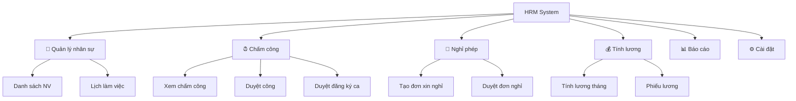
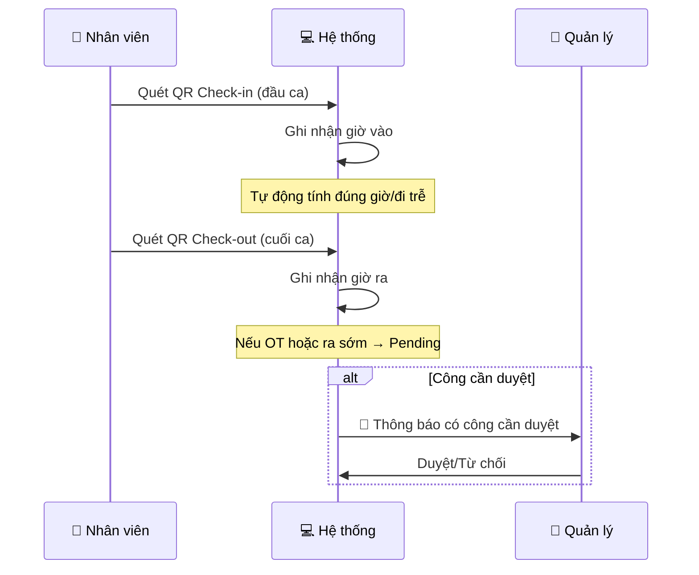
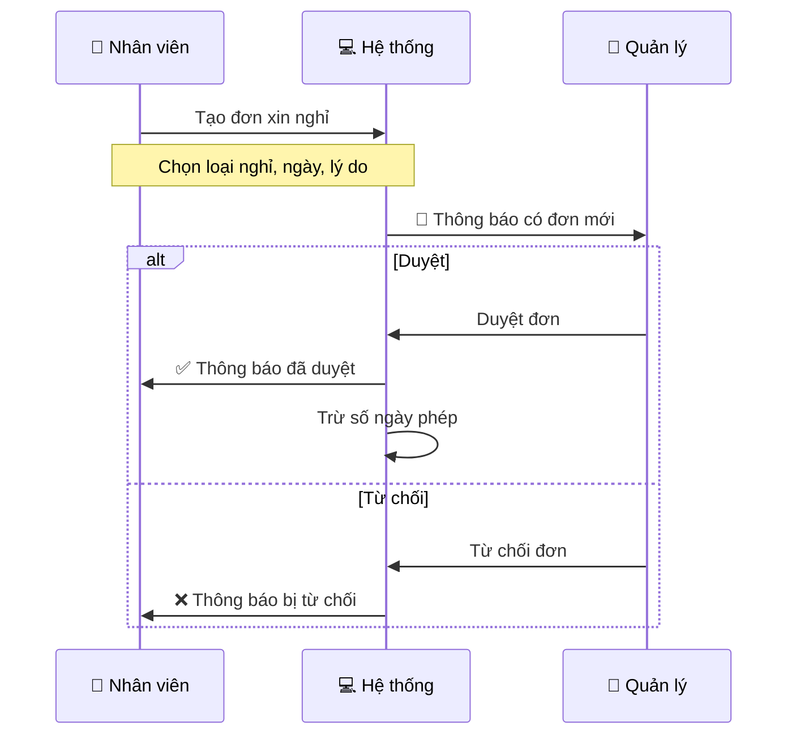
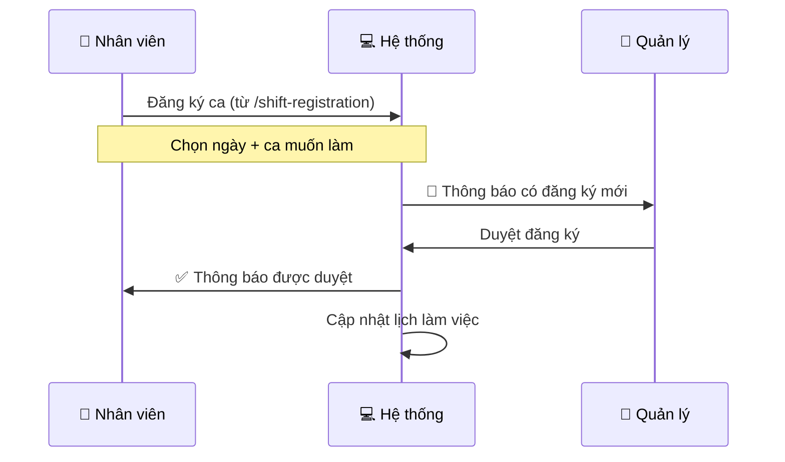
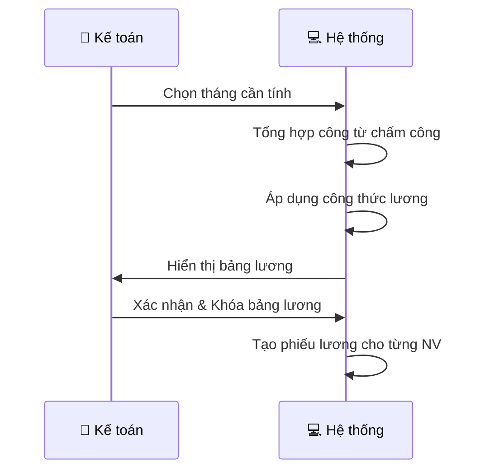

# 📚 HƯỚNG DẪN SỬ DỤNG HỆ THỐNG HRM

## Mục lục
1. [Tổng quan hệ thống](#1-tổng-quan-hệ-thống)
2. [Đăng nhập](#2-đăng-nhập)
3. [Vai trò người dùng](#3-vai-trò-người-dùng)
4. [Quy trình nghiệp vụ](#4-quy-trình-nghiệp-vụ)
5. [Hướng dẫn theo chức năng](#5-hướng-dẫn-theo-chức-năng)

---

## 1. Tổng quan hệ thống

Hệ thống HRM (Human Resource Management) giúp quản lý nhân sự, chấm công, nghỉ phép, và tính lương cho doanh nghiệp.

### Sơ đồ chức năng

---

## 2. Đăng nhập

1. Truy cập website: `https://quantrinhansulillo.vn`
2. Nhập **Tên đăng nhập** và **Mật khẩu**
3. Nhấn **Đăng nhập**

> [!TIP]
> Liên hệ Admin nếu quên mật khẩu hoặc cần tạo tài khoản mới.

---

## 3. Vai trò người dùng

| Vai trò | Mô tả | Quyền hạn |
|---------|-------|-----------|
| 🔴 **Admin** | Quản trị viên | Toàn quyền trên hệ thống |
| 🟡 **Kế toán** | Kế toán | Tính lương, xem công, báo cáo |
| 🟢 **Quản lý** | Quản lý chi nhánh | Duyệt công, duyệt phép, quản lý NV |
| 🔵 **Nhân viên** | Nhân viên thường | Xem thông tin cá nhân, chấm công |

---

## 4. Quy trình nghiệp vụ

### 4.1. Quy trình chấm công hàng ngày

**Bước thực hiện (Nhân viên):**
1. Vào trang `/attendance` hoặc quét QR code của chi nhánh
2. Cho phép camera → Quét mã QR
3. Hệ thống tự động ghi nhận giờ vào/ra

**Duyệt công (Quản lý):**
1. Vào **Chấm công → Duyệt công**
2. Xem danh sách công đang chờ duyệt (badge đỏ)
3. Chọn **Duyệt** hoặc **Từ chối**

---

### 4.2. Quy trình xin nghỉ phép

**Bước thực hiện (Nhân viên):**
1. Vào **Hồ sơ của tôi**
2. Chọn tab **Nghỉ phép** → **Tạo đơn mới**
3. Điền thông tin: Loại nghỉ, Từ ngày, Đến ngày, Lý do
4. Nhấn **Gửi yêu cầu**

**Duyệt phép (Quản lý):**
1. Vào **Chấm công → Duyệt nghỉ phép**
2. Xem danh sách đơn đang chờ
3. Chọn **Duyệt** hoặc **Từ chối** (kèm ghi chú)

---

### 4.3. Quy trình đăng ký ca làm việc

**Bước thực hiện:**
1. Nhân viên vào `/dashboard/shift-registration`
2. Chọn các ngày và ca muốn đăng ký
3. Nhấn **Đăng ký**
4. Quản lý vào **Duyệt đăng ký ca** để duyệt

---

### 4.4. Quy trình tính lương

**Bước thực hiện:**
1. Vào **Tính lương**
2. Chọn Tháng/Năm cần tính
3. Nhấn **Tính lương** → Hệ thống tự động tính
4. Kiểm tra và điều chỉnh nếu cần
5. **Xuất phiếu lương** cho từng nhân viên

---

## 5. Hướng dẫn theo chức năng

### 5.1. 📊 Tổng quan (Dashboard)

Hiển thị thống kê nhanh:
- Số nhân viên hiện tại
- Số người đang làm việc hôm nay
- Số ngày OT tháng này
- Biểu đồ biến động nhân sự
- Nhân viên mới

---

### 5.2. 👤 Hồ sơ của tôi

| Tab | Nội dung |
|-----|----------|
| Thông tin cá nhân | Họ tên, ngày sinh, địa chỉ, CCCD... |
| Công việc | Phòng ban, chức vụ, ngày vào làm |
| Nghỉ phép | Số ngày phép còn, lịch sử nghỉ |
| Chấm công | Lịch sử chấm công của mình |
| Lương | Xem phiếu lương (nếu được phép) |

---

### 5.3. 👥 Quản lý nhân sự (Admin/Manager)

#### Danh sách nhân viên
- Xem, thêm, sửa, xóa nhân viên
- Lọc theo phòng ban, chi nhánh
- Xuất Excel/PDF

#### Lịch làm việc
- Xem lịch làm việc theo tuần/tháng
- Xếp ca cho nhân viên
- Xem ai đang làm việc

---

### 5.4. ⏰ Chấm công

#### Xem chấm công
- Xem bảng chấm công theo tháng
- Lọc theo nhân viên, phòng ban
- Xem chi tiết: giờ vào, giờ ra, trạng thái

#### Duyệt công (Manager)
- Danh sách công cần duyệt
- Duyệt/Từ chối từng bản ghi
- Badge đỏ hiển thị số lượng pending

#### Duyệt đăng ký ca (Manager)
- Xem các đăng ký ca từ nhân viên
- Duyệt hàng loạt hoặc từng đăng ký

#### Duyệt nghỉ phép (Manager)
- Xem đơn xin nghỉ
- Duyệt/Từ chối kèm ghi chú

---

### 5.5. 💰 Tính lương (Admin/Kế toán)

1. **Chọn tháng** cần tính
2. Hệ thống tự động tính dựa trên:
   - Số ngày công thực tế
   - Số giờ OT
   - Các khoản phụ cấp, khấu trừ
3. **Xuất bảng lương** hoặc **Phiếu lương** cho từng NV

---

### 5.6. 📊 Báo cáo (Admin/Manager/Kế toán)

Các loại báo cáo:
- Báo cáo chấm công
- Báo cáo nghỉ phép
- Báo cáo lương
- Báo cáo nhân sự

---

### 5.7. ⭐ Đánh giá (Admin/Manager)

- Tạo tiêu chí đánh giá theo phòng ban
- Đánh giá hiệu suất nhân viên
- Xem lịch sử đánh giá

---

### 5.8. 🔔 Thông báo

- Xem tất cả thông báo hệ thống
- Đánh dấu đã đọc
- Cài đặt loại thông báo muốn nhận

---

### 5.9. ⚙️ Cài đặt (Admin only)

| Mục | Mô tả |
|-----|-------|
| **Cài đặt giờ** | Giờ làm việc, quy định OT, ngày lễ |
| **Chi nhánh** | Quản lý chi nhánh, mã QR chấm công |
| **Danh mục** | Phòng ban, chức vụ |
| **Loại nghỉ phép** | Phép năm, nghỉ ốm, v.v. |
| **Phân quyền** | Cấp quyền chi tiết cho người dùng |
| **Mẫu phiếu lương** | Tùy chỉnh template phiếu lương |
| **Quản lý Users** | Thêm/sửa/xóa tài khoản đăng nhập |

---

## 📱 Sử dụng trên điện thoại

- Website responsive, hoạt động tốt trên điện thoại
- Menu nằm ở thanh dưới cùng
- Quét QR chấm công qua camera điện thoại

---

## ❓ Câu hỏi thường gặp

### Q: Quên mật khẩu làm sao?
**A:** Liên hệ Admin để reset mật khẩu.

### Q: Không thể quét QR chấm công?
**A:** 
1. Cho phép website truy cập camera
2. Đảm bảo ánh sáng đủ
3. Kiểm tra mã QR còn hiệu lực

### Q: Công hiển thị "Pending" là sao?
**A:** Công cần được Quản lý duyệt (do OT, ra sớm, hoặc bất thường).

### Q: Làm sao biết có việc cần duyệt?
**A:** Badge đỏ sẽ hiển thị trên menu tương ứng. Refresh định kỳ mỗi 30 giây.

---

## 📞 Hỗ trợ

Nếu gặp vấn đề, liên hệ:
- **Admin hệ thống**
- **Phòng IT**

---

*Cập nhật lần cuối: 29/12/2025*
